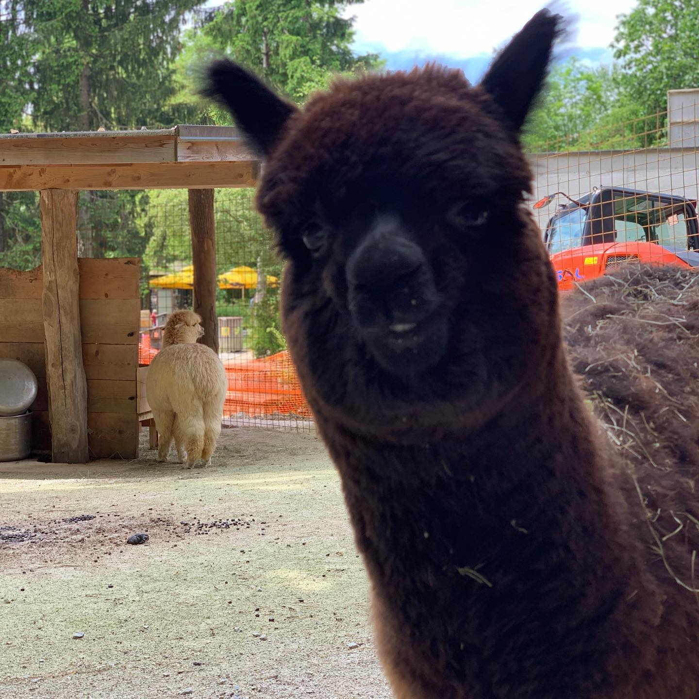

### Hi there 👋, my name is Gregor
#### I am a fullstack software engineer & architect

Yes, this alpaca image got my profile far more interesting.
 

Java enthusiast, alpaca lover, full stack application developer who likes to use new technologies and patterns.

Skills: Java / Python / REACT / JS

- 🔭 I’m currently working on company digitalization process using microservices 
- 🌱 I’m currently learning blockchain
- 👯 I’m looking to collaborate on open source 
- 🤔 I’m looking for help with Jaffas library 
- 💬 Ask me about anything 
- 📫 How to reach me: You can try one of social platforms 
- ⚡ Fun fact: There must be something bigger out there 

### Languages and Tools:

 
 
List of favourite repos:

- You dont need library https://github.com/you-dont-need/
- TLDR https://github.com/sderosiaux/every-single-day-i-tldr

  

